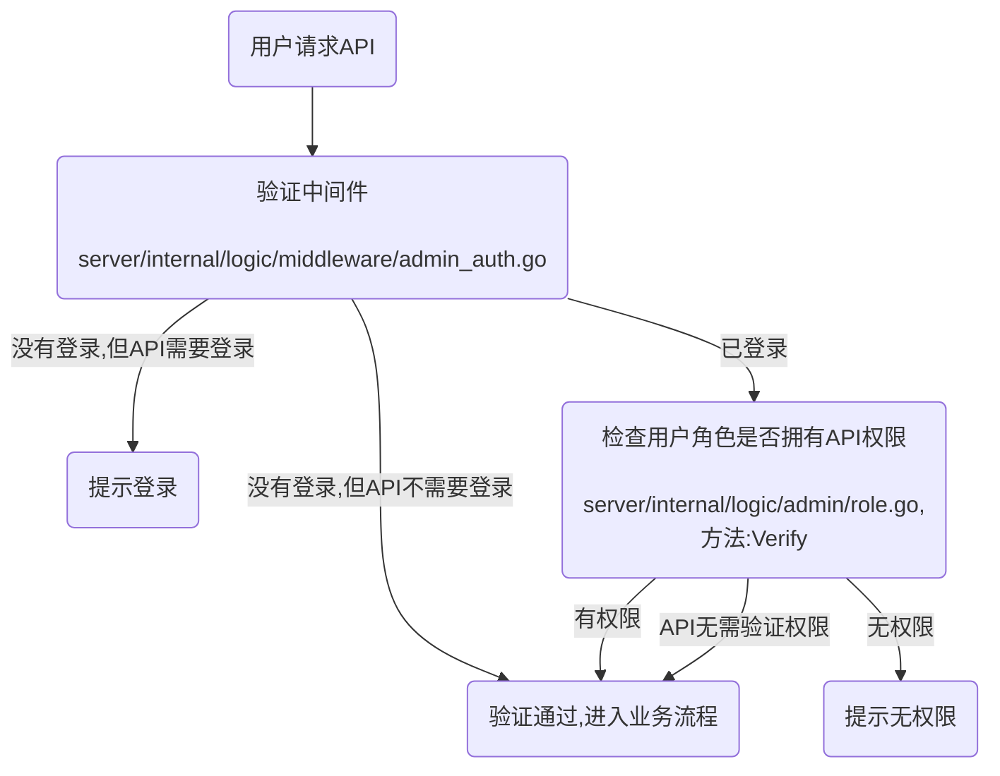

## 权限控制

目录

- 一、菜单权限
- 二、数据权限


### 一、菜单权限

> 菜单权限可以控制web后台菜单功能，每个菜单可以绑定一个或多个API权限，API权限决定了用户是否可以调用服务端接口。

#### 为角色添加菜单权限

1、HotGo后台 -> 权限管理 -> 菜单权限 -> 找到添加菜单，按照表单提示添加你的菜单信息。

2、添加菜单完成后，到 权限管理 -> 角色权限 -> 找到一位已有角色或者添加新角色 -> 在列表右侧操作栏找到菜单权限打开 -> 将第1步中添加的菜单分配给该角色即可。

#### 细粒度权限

> 一般用于web后台页面上的功能按钮，对不同的角色展示不同的按钮时会用到。

1、参考【为角色添加菜单权限】添加一个按钮类型的菜单。并为菜单分配API权限，假设你分配权限是：/test/index

2、在web页面中创建一个按钮，如下：

```vue
<template>
  <div>
    <n-button v-if="hasPermission(['/test/index'])">拥有[/test/index]权限可见</n-button>
  </div>
</template>

<script lang="ts" setup>
import { usePermission } from '@/hooks/web/usePermission';
const { hasPermission } = usePermission();

</script>

```

#### 菜单表主要字段解释

- 代码片段：[server/internal/model/input/adminin/menu.go](../../server/internal/model/input/adminin/menu.go)

```go
type MenuRouteMeta struct {
	// 解释参考：https://naive-ui-admin-docs.vercel.app/guide/router.html#%E5%A4%9A%E7%BA%A7%E8%B7%AF%E7%94%B1
	Title string `json:"title"` // 菜单名称 一般必填
	//Disabled   bool   `json:"disabled,omitempty"`   // 禁用菜单
	Icon       string `json:"icon,omitempty"`       // 菜单图标
	KeepAlive  bool   `json:"keepAlive,omitempty"`  // 缓存该路由
	Hidden     bool   `json:"hidden,omitempty"`     // 隐藏菜单
	Sort       int    `json:"sort,omitempty"`       // 排序越小越排前
	AlwaysShow bool   `json:"alwaysShow,omitempty"` // 取消自动计算根路由模式
	ActiveMenu string `json:"activeMenu,omitempty"` // 当路由设置了该属性，则会高亮相对应的侧边栏。
	// 这在某些场景非常有用，比如：一个列表页路由为：/list/basic-list
	// 点击进入详情页，这时候路由为/list/basic-info/1，但你想在侧边栏高亮列表的路由，就可以进行如下设置
	// 注意是配置高亮路由 `name`，不是path
	IsRoot      bool   `json:"isRoot,omitempty"`      // 是否跟路由 顶部混合菜单，必须传 true，否则左侧会显示异常（场景就是，分割菜单之后，当一级菜单没有子菜单）
	FrameSrc    string `json:"frameSrc,omitempty" `   // 内联外部地址
	Permissions string `json:"permissions,omitempty"` // 菜单包含权限集合，满足其中一个就会显示
	Affix       bool   `json:"affix,omitempty"`       // 是否固定 设置为 true 之后 多页签不可删除
	Type        int    `json:"type"`                  // 菜单类型
}
```


#### API权限验证流程



#### 菜单权限添加或修改后多久生效？

- API权限实时生效，web后台菜单刷新页面后生效，无需重启服务


### 二、数据权限

> 数据权限是某人只能看到某些数据，可以为某人设置一定的数据范围，让其只能看到允许他看到的数据。

> 例如：公司存在多个销售部门，不同的部门仅能查看到自己所属部门下的数据；再如：用户有多级代理商，只能查看自己和自己下级的数据。

#### 目前已经支持的数据权限如下

| 数据范围    | 描述                                         |
|---------|--------------------------------------------|
| 全部权限    | 不做过滤，可以查看所有数据                              |
| 当前部门    | 仅可以看到所属部门下的数据                              |
| 当前以及下部门 | 仅可以看到所属以及下级部门的数据                           |
| 自定义部门   | 可以看到设置的指定部门，支持多个                           |
| 仅自己     | 仅可以看到自己的数据                                 |
| 自己和直属下级 | 仅可以看到自己和直属下级的数据，直属下级是指当前用户往下1级的用户          |
| 自己和全部下级 | 仅可以看到自己和全部下级的数据，全部下级是指当前用户所有的下级用户，包含其下级的下级 |

#### 如何区分部门和下级用户？

- 在实际使用时，部门更多的是在公司或机构中使用，可以通过在 组织管理 -> 后台用户 ->为用户绑定部门
- 下级用户在代理商或分销系统中比较常见，后台用户由谁添加的，那么被添加的用户就是其下级用户。后续也将开放邀请码绑定下级功能。

#### 如何判断数据是谁的？

- 在数据库建表时，只要表中包含字段：`created_by`或`member_id`即可过滤 [仅自己、自己和直属下级、自己和全部下级] 类型的数据权限

#### 如何在具体业务中使用数据权限过滤？

- 只需在查询、更新或删除等ORM链式操作中加入相应`Handler`方法即可

- 如果你想对Handler有更多详细了解，请查看：https://goframe.org/pages/viewpage.action?pageId=20087340

- 下面提供一个简单使用例子：

```go
package main

import (
	"context"
	"hotgo/internal/dao"
	"hotgo/internal/library/hgorm/handler"
)

func test(ctx context.Context)  {
    dao.AdminPost.Ctx(ctx).Where("id", 1).Handler(handler.FilterAuth).Scan(&res)
}
```

- 如果表中没有字段：`created_by`或`member_id`，也可以使用自定义字段方法来过滤数据权限，如下：

```go
package main

import (
	"context"
	"hotgo/internal/dao"
	"hotgo/internal/library/hgorm/handler"
)

func test(ctx context.Context)  {
	dao.AdminPost.Ctx(ctx).Where("id", 1).Handler(handler.FilterAuthWithField("test_field")).Scan(&res)
}
```


- 过滤方法实现请参考：[server/internal/library/hgorm/handler/filter_auth.go](../../server/internal/library/hgorm/handler/filter_auth.go)


