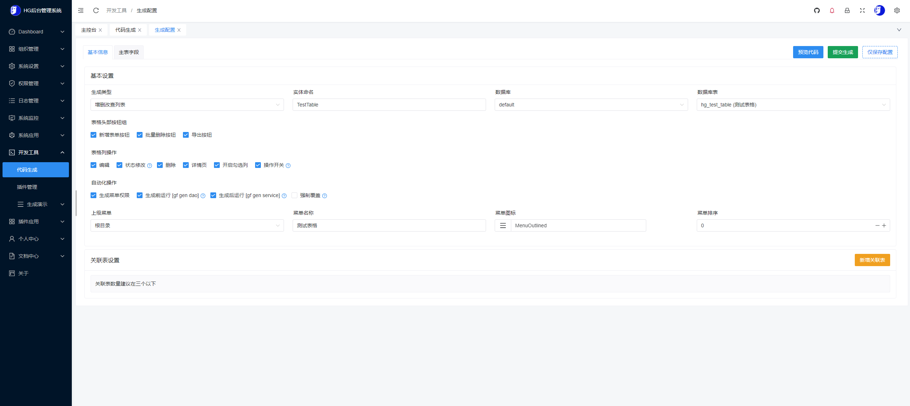
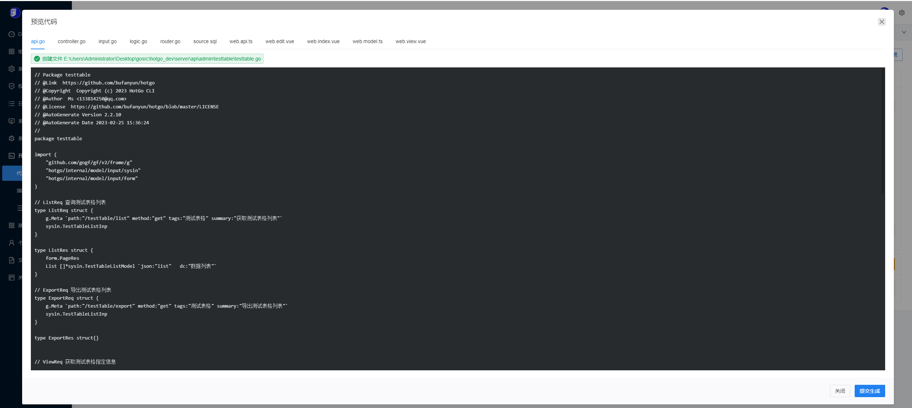
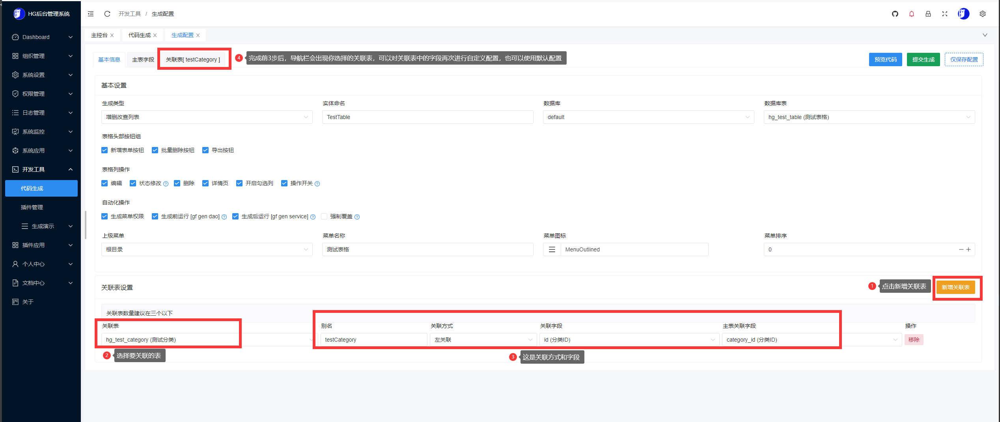
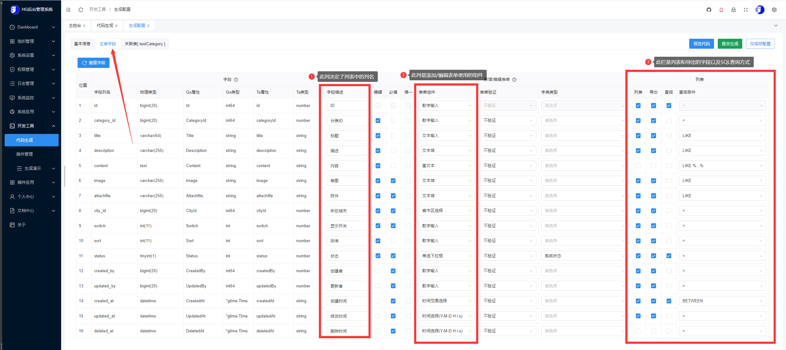
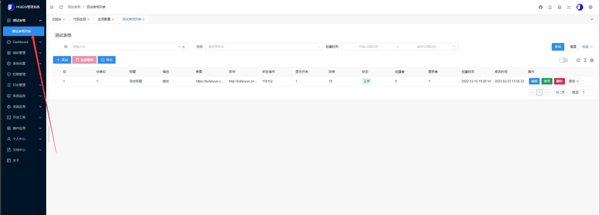
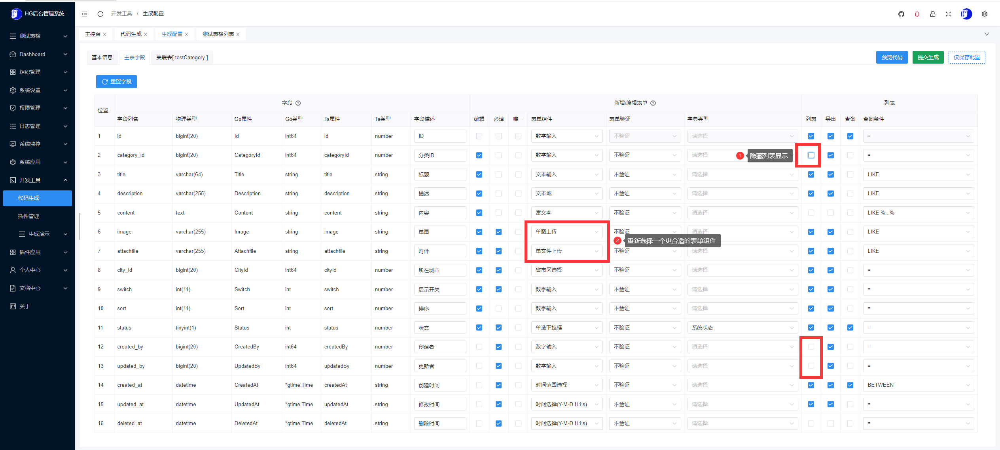
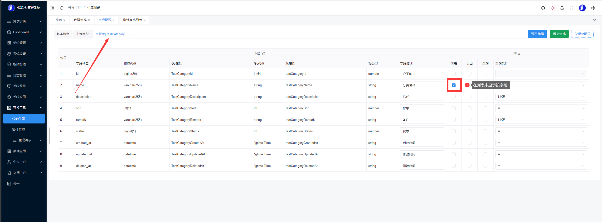
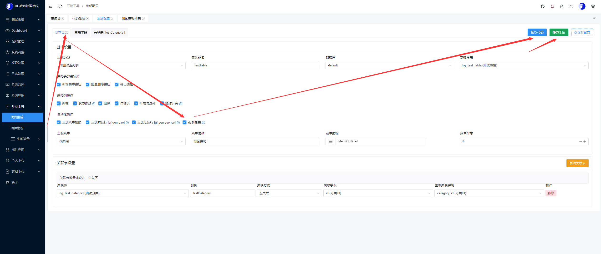
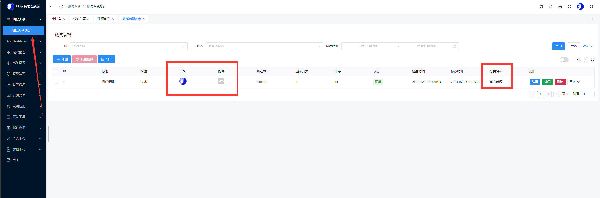
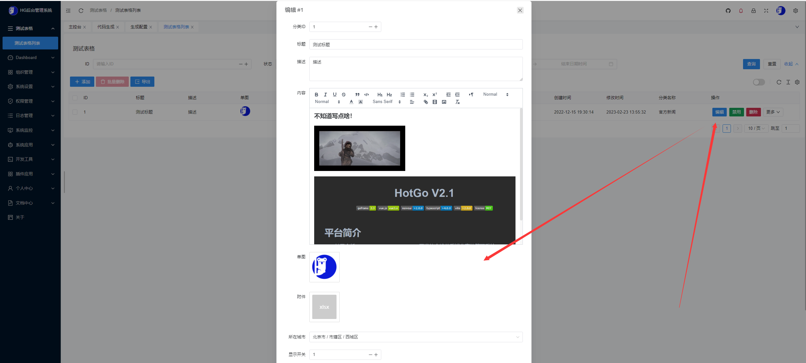

## 代码生成

目录

- 使用条件
- 生成配置
- 一个生成增删改查列表例子
- 内置gf-cli
- 自定义生成模板


> 在HotGo中可以通过后台开发工具快速的一键生成CRUD，自动生成Api、控制器、业务逻辑、Web页面、表单组件、菜单权限等。


### 使用条件

- hotgo 版本号 >= 2.2.10
- 使用前必须先看 [数据库](sys-db.md)

#### 增删改查列表

- 表自增长字段为 `id`

#### 关系树列表

- 表自增长字段为 `id`


### 生成配置

- 注意：线上环境务必将allowedIPs参数设为空，考虑到项目安全问题请勿线上生成使用！

```yaml
hggen:
  allowedIPs: ["127.0.0.1", "*"]                                      # 白名单，*代表所有，只有允许的IP后台才能使用生成代码功能
  selectDbs: [ "default" ]                                            # 可选生成表的数据库配置名称，支持多库
  disableTables : ["hg_sys_gen_codes","hg_admin_role_casbin"]         # 禁用的表，禁用以后将不会在选择表中看到
  delimiters: ["@{", "}"]                                             # 模板引擎变量分隔符号
  # 生成应用模型，所有生成模板允许自定义，可以参考default模板进行改造
  application:
    # CRUD模板
    crud:
      templates:
        # 默认的主包模板
        - group: "default"                                              # 分组名称
          isAddon: false                                                # 是否为插件模板 false｜true
          masterPackage: "sys"                                          # 主包名称，需和controllerPath、logicPath、inputPath保持关联
          templatePath: "./resource/generate/default/curd"              # 模板路径
          apiPath: "./api/admin"                                        # gfApi生成路径
          controllerPath: "./internal/controller/admin/sys"             # 控制器生成路径
          logicPath : "./internal/logic/sys"                            # 主要业务生成路径
          inputPath: "./internal/model/input/sysin"                     # 表单过滤器生成路径
          routerPath : "./internal/router/genrouter"                    # 生成路由表路径
          sqlPath : "./storage/data/generate"                           # 生成sql语句路径
          webApiPath: "../web/src/api"                                  # webApi生成路径
          webViewsPath : "../web/src/views"                             # web页面生成路径

        # 默认的插件包模板
        - group: "addon"                                                # 分组名称
          isAddon: true                                                 # 是否为插件模板 false｜true
          masterPackage: "sys"                                          # 主包名称，需和controllerPath、logicPath、inputPath保持关联
          templatePath: "./resource/generate/default/curd"              # 模板路径
          apiPath: "./addons/{$name}/api/admin"                         # gfApi生成路径
          controllerPath: "./addons/{$name}/controller/admin/sys"       # 控制器生成路径
          logicPath : "./addons/{$name}/logic/sys"                      # 主要业务生成路径
          inputPath: "./addons/{$name}/model/input/sysin"               # 表单过滤器生成路径
          routerPath : "./addons/{$name}/router/genrouter"              # 生成路由表路径
          sqlPath : "./storage/data/generate/addons"                    # 生成sql语句路径
          webApiPath: "../web/src/api/addons/{$name}"                   # webApi生成路径
          webViewsPath : "../web/src/views/addons/{$name}"              # web页面生成路径

    # 关系树列表模板
    tree:
      templates:
        - group: "default"
          templatePath: "./resource/generate/default/tree"

    # 消息队列模板
    queue:
      templates:
        - group: "default"
          templatePath: "./resource/generate/default/queue"

    # 定时任务模板
    cron:
      templates:
        - group: "default"
          templatePath: "./resource/generate/default/cron"
```


### 一个生成增删改查列表例子

- 推荐使用热编译方式启动HotGo，这样生成完成页面自动刷新即可看到新生成内容，无需手动重启
- 服务端热编译启动：`gf run main.go`, web前端启动：`yarn dev`

1、创建数据表

1.1 创建测试表格表`hg_test_table`：
```mysql
CREATE TABLE `hg_test_table` (
  `id` bigint(20) NOT NULL AUTO_INCREMENT COMMENT 'ID',
  `category_id` bigint(20) NOT NULL COMMENT '分类ID',
  `title` varchar(64) NOT NULL COMMENT '标题',
  `description` varchar(255) NOT NULL COMMENT '描述',
  `content` text NOT NULL COMMENT '内容',
  `image` varchar(255) DEFAULT NULL COMMENT '单图',
  `attachfile` varchar(255) DEFAULT NULL COMMENT '附件',
  `city_id` bigint(20) DEFAULT '0' COMMENT '所在城市',
  `switch` int(11) DEFAULT '1' COMMENT '显示开关',
  `sort` int(11) NOT NULL COMMENT '排序',
  `status` tinyint(1) DEFAULT '1' COMMENT '状态',
  `created_by` bigint(20) DEFAULT '0' COMMENT '创建者',
  `updated_by` bigint(20) DEFAULT '0' COMMENT '更新者',
  `created_at` datetime DEFAULT NULL COMMENT '创建时间',
  `updated_at` datetime DEFAULT NULL COMMENT '修改时间',
  `deleted_at` datetime DEFAULT NULL COMMENT '删除时间',
  PRIMARY KEY (`id`)
) ENGINE=InnoDB AUTO_INCREMENT=2 DEFAULT CHARSET=utf8 COMMENT='测试表格';

```

1.2 测试分类表`hg_test_category`:
- 注意：该表为了方便功能演示已经内置无需再次创建，此处提示表结构只是为了方便大家梳理关联表关系
```mysql
CREATE TABLE `hg_test_category` (
  `id` bigint(20) NOT NULL AUTO_INCREMENT COMMENT '分类ID',
  `name` varchar(255) NOT NULL COMMENT '分类名称',
  `description` varchar(255) DEFAULT NULL COMMENT '描述',
  `sort` int(11) NOT NULL COMMENT '排序',
  `remark` varchar(255) DEFAULT NULL COMMENT '备注',
  `status` tinyint(1) DEFAULT '1' COMMENT '状态',
  `created_at` datetime DEFAULT NULL COMMENT '创建时间',
  `updated_at` datetime DEFAULT NULL COMMENT '修改时间',
  `deleted_at` datetime DEFAULT NULL COMMENT '删除时间',
  PRIMARY KEY (`id`)
) ENGINE=InnoDB AUTO_INCREMENT=10 DEFAULT CHARSET=utf8 COMMENT='测试分类';

```

1.3 插入测试数据
```mysql
INSERT INTO `hg_test_table` (`id`, `category_id`, `title`, `description`, `content`, `image`, `attachfile`, `city_id`, `switch`, `sort`, `status`, `created_by`, `updated_by`, `created_at`, `updated_at`, `deleted_at`) VALUES (1, 1, '测试标题', '描述', '<h2><strong>不知道写点啥！</strong></h2><p><br></p><iframe class=\"ql-video\" frameborder=\"0\" allowfullscreen=\"true\" src=\"https://media.w3.org/2010/05/sintel/trailer.mp4\"></iframe><p><br></p><p></p>', 'https://bufanyun.cn-bj.ufileos.com/hotgo/logo.sig.png', 'http://bufanyun.cn-bj.ufileos.com/hotgo/attachment/2022-12-30/cpf1x44idoycrtajf2.xlsx', 110102, 1, 10, 1, 0, 1, '2022-12-15 19:30:14', '2023-02-23 13:55:32', NULL);

```


2、创建生成配置
- 登录HotGo后台 -> 开发工具 -> 代码生成 -> 找到立即生成按钮并打开，选择和填写如下参数：


3、自定义配置
- 确认配置无误后，点击生成配置会自动跳转到生成配置页面，如下：
  


- 你可以在该页面点击`预览代码`查看生成的内容，如果无需调整亦可以直接点击`提交生成`，以下是预览代码效果：



- 如果你对默认的生成配置不满意，可以根据页面表单提示，自定义表格属性和字段属性

- 这里假设我们要一个关联表，让表`hg_test_table`字段`category_id`去关联 表`hg_test_category`字段`id`，我们可以这样做：




- 如果你想调整主表每列字段的显示方式，可以点击上方导航栏中的 [主表字段] 进行调整
- 这里我们不做任何调整直接进入下一步。目的是为了后续演示对最终生成结果不满意的再次调整方案



4、以上内容都已配置无误后，点击提交生成即可。

- 如果你使用的热编译，那么页面会在生成成功后立即刷新，刷新完成你即可在后台菜单栏中看到`测试表格`菜单。如果不是使用热编译启动，请手动重启服务后刷新。

> 注意：热编译自动刷新时，考虑到实际开发环境电脑配置不同，web端可能会优先于服务端重启加载完成，此时会出现新生成菜单没有加载出来或某接口请求超时问题，这是服务端正在启动中导致的，一般稍等几秒再试即可。

- 接下来让我们看看生成的表格页面，效果如下：




5、假设我们对生成结果不满意，有新的优化需求如下：
1. 把`单图`、`附件`改换成上传组件
2. 把`创建者`、`更新者`隐藏
3. 把`分类ID`隐藏，然后把关联表中的`分类名称`显示出来

> 那么我们可以回到 开发工具 -> 代码生成 -> 找到刚刚生成的记录 -> 在右侧操作栏中点击生成配置，再次进入配置页面做如下操作即可：

1. 点击上方导航栏[主表字段]，调整字段选项：




2. 点击上方导航栏[关联表]，调整字段选项：




3. 返回[基本信息]，勾选强制覆盖，然后点击`预览代码`，确认生成代码无误后点击`提交生成`




- 生成完成刷新页面后，再次来到`测试表格`，发现表格已经调整到了我们预期效果

1. 列表效果：



2. 编辑表单效果



   
- 至此生成增删改查列表示例结束！


### 内置gf-cli

> 由于gf版本更新较常出现向下不兼容的情况，所以我们为了保证生成代码的依赖稳定性，我们将gf-cli工具内置到了系统中并做了一些在线执行的调整。

- 我们会定期更新和gf最新版本生成功能保持一致，这样不论是你通过gf命令还是通过后台生成的代码格式都是一样的，遵循相同的代码规范和开发方式

- 后续我们也将开放在线运行`gf gen dao`、`gf gen service`功能。在做插件开发时也会支持到在线生成插件下的service接口，这将会使得插件开发更加方便

### 自定义生成模板

> 系统内置了两组CURD生成模板，请参考[生成配置]。default：是默认的生成到主模块下；addon：是默认生成到指定的插件下

- 如果你在实际的开发过程中默认模板需要调整的地方较多时，HotGo允许你新建新的模板分组来满足你的需求。新的模板可根据现有模板基础拷贝一份出来做改造，默认模板目录：[server/resource/generate/default](../../server/resource/generate/default)

