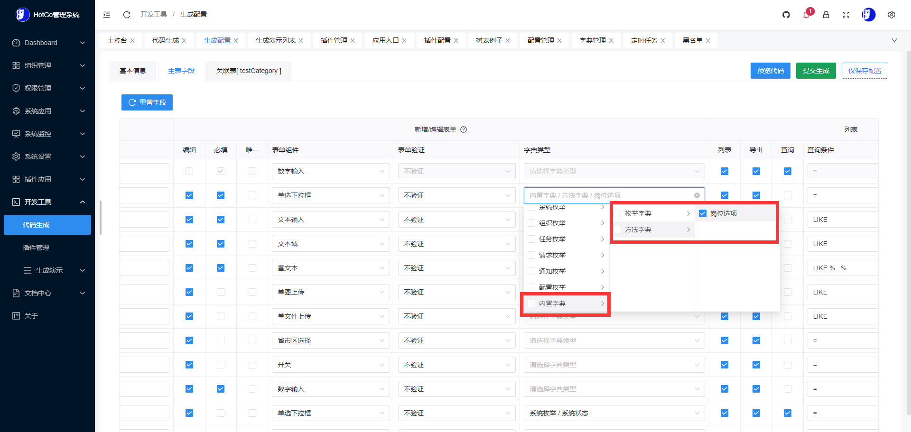

## 功能扩展库

目录

- 缓存驱动
- 请求上下文
- JWT
- 数据字典
- 地理定位（待写）
- 通知（待写）


### 缓存驱动

> 系统默认的缓存驱动为file，目前已支持：memory|redis|file等多种驱动。请自行选择适合你的驱动使用。

- 配置文件：server/manifest/config/config.yaml

```yaml
#缓存
cache:
  adapter: "file"                    # 缓存驱动方式，支持：memory|redis|file，不填默认memory
  fileDir: "./storage/cache"         # 文件缓存路径，adapter=file时必填
```

#### 使用方式
```go
package main

import (
	"hotgo/internal/library/cache"
	"github.com/gogf/gf/v2/os/gctx"
)

func  test() {
	ctx := gctx.New()

	// 添加/修改
	cache.Instance().Set(ctx, "qwe", 123, 0)

	// 查询
	cache.Instance().Get(ctx, "qwe")

	// 删除
	cache.Instance().Remove(ctx, "qwe")
	
	// 更多方法请参考：https://goframe.org/pages/viewpage.action?pageId=27755640
}

```

### 请求上下文

- 主要用于在处理HTTP和websocket请求时通过中间件将用户、应用、插件等信息绑定到上下文中，方便在做业务处理时用到这些信息

```go
package admin

import (
	"fmt"
	"context"
	"hotgo/internal/library/contexts"
	"hotgo/internal/library/addons"
)


func test(ctx context.Context) {
	// 获取当前请求的所有上下文变量
	var ctxModel = contexts.Get(ctx)
	fmt.Printf("当前请求的所有上下文变量：%+v\n", ctxModel)

	// 获取当前请求的应用模块
	var module = contexts.GetModule(ctx)
	fmt.Printf("当前请求的应用：%+v\n", module)
	
	// 获取当前请求的用户信息
	var member = contexts.GetUser(ctx)
	fmt.Printf("当前访问用户信息：%+v\n", member)
	
	// 获取当前请求的插件模块
	fmt.Printf("当前是否为插件请求：%v", contexts.IsAddonRequest(ctx))
	if contexts.IsAddonRequest(ctx) {
		fmt.Printf("当前插件名称：%v", contexts.GetAddonName(ctx))
		fmt.Printf("当前插件信息：%v", addons.GetModule(contexts.GetAddonName(ctx)))
	}
}

```

### JWT

- 基于jwt+缓存驱动实现的用户登录令牌功能，支持自动续约，解决了jwt服务端无法退出问题和jwt令牌无法主动失效问题

#### 配置示例
```yaml
# 登录令牌
token:
  secretKey: "hotgo123"                  # 令牌加密秘钥，考虑安全问题生产环境中请修改默认值
  expires: 604800                        # 令牌有效期，单位：秒。默认7天
  autoRefresh: true                      # 是否开启自动刷新过期时间， false|true 默认为true
  refreshInterval: 86400                 # 刷新间隔，单位：秒。必须小于expires，否则无法触发。默认1天内只允许刷新一次
  maxRefreshTimes: 30                    # 最大允许刷新次数，-1不限制。默认30次
  multiLogin: true                       # 是否允许多端登录， false|true 默认为true

```

```go
package admin

import (
	"fmt"
	"context"
	"hotgo/internal/library/token"
	"hotgo/internal/model"
)


func test(ctx context.Context) {
	// 登录
	user := &model.Identity{
		Id:       mb.Id,
		Pid:      mb.Pid,
		DeptId:   mb.DeptId,
		RoleId:   ro.Id,
		RoleKey:  ro.Key,
		Username: mb.Username,
		RealName: mb.RealName,
		Avatar:   mb.Avatar,
		Email:    mb.Email,
		Mobile:   mb.Mobile,
		App:      consts.AppAdmin,
		LoginAt:  gtime.Now(),
	}

	loginToken, expires, err := token.Login(ctx, user)
	if err != nil {
		return nil, err
	}
	
	// gf请求对象
	r := *ghttp.Request
	
	// 获取登录用户信息
	user, err := token.ParseLoginUser(r)
	if err != nil {
		return
	}
	
	// 注销登录
	err = token.Logout(r)
}

```

### 数据字典

- hotgo增加了对枚举字典和自定义方法字典的内置支持，从而在系统中经常使用的一些特定数据维护基础上做出了增强。

#### 字典数据选项
- 文件路径：server/internal/model/dict.go
```go
package model

// Option 字典数据选项
type Option struct {
	Key       interface{} `json:"key"`
	Label     string      `json:"label"     description:"字典标签"`
	Value     interface{} `json:"value"     description:"字典键值"`
	ValueType string      `json:"valueType" description:"键值数据类型"`
	Type      string      `json:"type"      description:"字典类型"`
	ListClass string      `json:"listClass" description:"表格回显样式"`
}
```

#### 枚举字典
- 适用于系统开发期间内置的枚举数据，这样即维护了枚举值，又关联了数据字典

##### 一个例子
- 定义枚举值和字典数据选项，并注册字典类型
- 文件路径：server/internal/consts/credit_log.go

```go
package consts

import (
	"hotgo/internal/library/dict"
	"hotgo/internal/model"
)

func init() {
	dict.RegisterEnums("creditType", "资金变动类型", CreditTypeOptions)
	dict.RegisterEnums("creditGroup", "资金变动分组", CreditGroupOptions)
}

const (
	CreditTypeBalance  = "balance"  // 余额
	CreditTypeIntegral = "integral" // 积分
)

const (
	CreditGroupDecr            = "decr"             // 扣款
	CreditGroupIncr            = "incr"             // 加款
	CreditGroupOpDecr          = "op_decr"          // 操作扣款
	CreditGroupOpIncr          = "op_incr"          // 操作加款
	CreditGroupBalanceRecharge = "balance_recharge" // 余额充值
	CreditGroupBalanceRefund   = "balance_refund"   // 余额退款
	CreditGroupApplyCash       = "apply_cash"       // 申请提现
)

// CreditTypeOptions 变动类型
var CreditTypeOptions = []*model.Option{
	dict.GenSuccessOption(CreditTypeBalance, "余额"),
	dict.GenInfoOption(CreditTypeIntegral, "积分"),
}

// CreditGroupOptions 变动分组
var CreditGroupOptions = []*model.Option{
	dict.GenWarningOption(CreditGroupDecr, "扣款"),
	dict.GenSuccessOption(CreditGroupIncr, "加款"),
	dict.GenWarningOption(CreditGroupOpDecr, "操作扣款"),
	dict.GenSuccessOption(CreditGroupOpIncr, "操作加款"),
	dict.GenWarningOption(CreditGroupBalanceRefund, "余额退款"),
	dict.GenSuccessOption(CreditGroupBalanceRecharge, "余额充值"),
	dict.GenInfoOption(CreditGroupApplyCash, "申请提现"),
}

```


#### 自定义方法字典
- 适用于非固定选项，如数据是从某个表/文件读取或从第三方读取，数据需要进行转换时使用

##### 方法字典接口
- 文件路径：server/internal/consts/credit_log.go
```go
package dict

// FuncDict 方法字典，实现本接口即可使用内置方法字典
type FuncDict func(ctx context.Context) (res []*model.Option, err error)
```

##### 一个例子
- 定义获取字典数据方法，并注册字典类型
- 文件路径：server/internal/logic/admin/post.go

```go
package admin

import (
	"context"
	"github.com/gogf/gf/v2/errors/gerror"
	"github.com/gogf/gf/v2/frame/g"
	"hotgo/internal/consts"
	"hotgo/internal/dao"
	"hotgo/internal/library/dict"
	"hotgo/internal/model"
	"hotgo/internal/model/entity"
	"hotgo/internal/service"
)

type sAdminPost struct{}

func NewAdminPost() *sAdminPost {
    return &sAdminPost{}
}

func init() {
    service.RegisterAdminPost(NewAdminPost())
    dict.RegisterFunc("adminPostOption", "岗位选项", service.AdminPost().Option)
}

// Option 岗位选项
func (s *sAdminPost) Option(ctx context.Context) (opts []*model.Option, err error) {
	var list []*entity.AdminPost
	if err = dao.AdminPost.Ctx(ctx).OrderAsc(dao.AdminPost.Columns().Sort).Scan(&list); err != nil {
		return nil, err
	}

	if len(list) == 0 {
		opts = make([]*model.Option, 0)
		return
	}

	for _, v := range list {
		opts = append(opts, dict.GenHashOption(v.Id, v.Name))
	}
	return
}
```

#### 代码生成支持
- 内置的枚举字典和自定义方法字典在生成代码时可以直接进行选择，生成代码格式和系统字典管理写法一致




#### 内置字典和系统字典的区分

##### 主要区别
- 系统字典由表：`hg_sys_dict_type`和`hg_sys_dict_data`共同进行维护，使用时需通过后台到字典管理中进行添加
- 内置字典是系统开发期间在代码层面事先定义和注册好的数据选项


##### 数据格式区别
- 系统字典所有ID都是大于0的int64类型
- 内置字典ID都是小于0的int64类型。枚举字典以20000开头，如：-200001381053496；方法字典以30000开头，如：-30000892528327；开头以外数字是根据数据选项的`key`值进行哈希算法得出

### 地理定位
```go
// 待写
```

### 通知
```go
// 待写
```