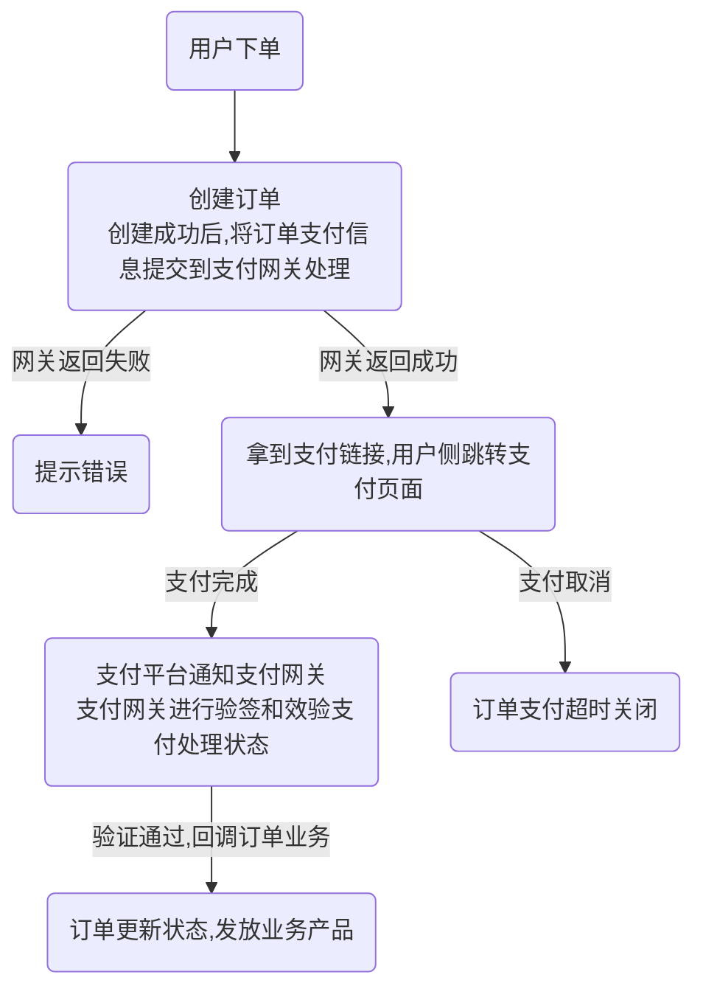

## 支付网关

目录

- 介绍
- 一个简单的支付流程
- 支付配置
- 创建支付订单
- 注册支付回调
- 订单退款
- 单笔转账（待更新）
- 其他


### 介绍
> 在web应用开发中，支付功能可以做为不可或缺的一部分，HotGo提供了相对通用的支付网关，目前已支持支付宝、微信支付、QQ支付，包含创建支付订单、支付回调、订单退款等功能，开发者几乎只需关注订单业务处理即可。

#### 一个简单的支付流程




### 支付配置
> 请到 系统设置 -> 配置管理 -> 支付配置 -> 找到你需要的支付方式，进行配置即可


### 创建支付订单

```go
package main

func main()  {
	// 创建支付网关订单
	create, err := service.Pay().Create(ctx, payin.PayCreateInp{
		Subject:    "充值100元",
		OrderSn:    "唯一业务订单编号",
		OrderGroup: "admin_order", // 订单分组，用于订单分类和绑定支付成功的回调方法
		PayType:    "wxpay",       // 微信支付
		TradeType:  "scan",        // 二维码扫码
		PayAmount:  "100",         // 100元
	})
}
```


### 注册支付回调
- 在文件`server/internal/logic/pay/notify.go` 加入你的业务订单分组回调方法，当订单支付成功验签通过后会自动进行回调，参考以下：

```go
package global

import (
	"hotgo/internal/consts"
	"hotgo/internal/library/payment"
	"hotgo/internal/service"
)

// RegisterNotifyCall 注册支付成功回调方法
func (s *sPay) RegisterNotifyCall() {
	payment.RegisterNotifyCallMap(map[string]payment.NotifyCallFunc{
		consts.OrderGroupAdminOrder: service.AdminOrder().PayNotify, // 后台充值订单
		// ...
	})
}
```

### 订单退款


```go
package main

func main()  {
	refund, err := service.PayRefund().Refund(ctx, payin.PayRefundInp{
		OrderSn:     "唯一业务订单编号",
		RefundMoney: "退款金额",
		Reason:      "买家申请退款原因",
		Remark:      "商家同意退款备注",
	})
}
```


### 单笔转账（待更新）


### 其他
- 由于各个支付平台中交易方式较多，如果目前已有的交易方式不满足你的支付场景需求，请自行参考gopay文档对文件`server/internal/library/payment/payment.go`中的`PayClient`接口实现进行扩展
- gopay文档地址：https://github.com/go-pay/gopay

