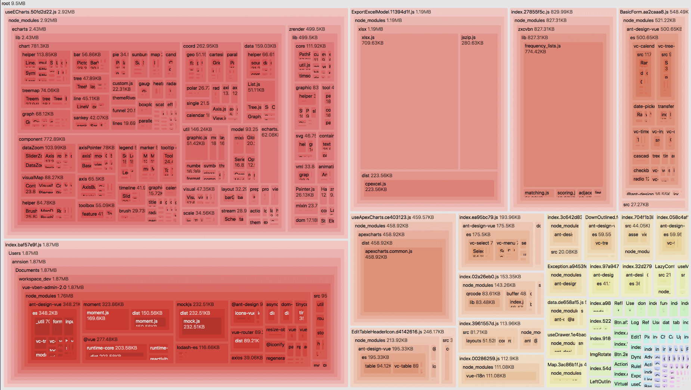

## 独立部署

目录

- 构建
- 旧版浏览器兼容
- 预览
- 分析构建文件体积
- 压缩
- 部署

> 在实际开发中，web前端也可能需要独立部署，所以在此提供一下部署方案。

### 构建

项目开发完成之后，执行以下命令进行构建
```shell
yarn build
```
构建打包成功之后，会在根目录生成 dist 文件夹，里面就是构建打包好的文件


### 旧版浏览器兼容

在 .env.production 内

设置 `VITE_LEGACY=true` 即可打包出兼容旧版浏览器的代码
```shell
VITE_LEGACY = true
``` 


### 预览

发布之前可以在本地进行预览，有多种方式，这里介绍两种

##### 不能直接打开构建后的 html 文件

使用项目自定的命令进行预览(推荐)
```shell
# 先打包在进行预览
yarn preview
# 直接预览本地 dist 文件目录
yarn preview:dist
```

- 本地服务器预览(通过 live-server)
```shell
# 1.全局安装live-server
yarn global add live-server
# 2. 进入打包的后目录
cd ./dist
# 本地预览，默认端口8080
live-server
# 指定端口
live-server --port 9000
```

### 分析构建文件体积
如果你的构建文件很大，可以通过项目内置 [rollup-plugin-analyzer](https://github.com/doesdev/rollup-plugin-analyzer) 插件进行代码体积分析，从而优化你的代码。
```shell
yarn report
```
运行之后，在自动打开的页面可以看到具体的体积分布，以分析哪些依赖有问题。

- 左上角可以切换 显示 gzip 或者 brotli




### 压缩

#### 开启 gzip 压缩

开启 gzip，并配合 nginx 的 `gzip_static` 功能可以大大加快页面访问速度

- 只需开启 `VITE_BUILD_COMPRESS='gzip'` 即可在打包的同时生成 .gz 文件

```shell
# 根据自己路径来配置更改
# 例如部署在nginx /next/路径下  则VITE_PUBLIC_PATH=/next/
VITE_PUBLIC_PATH=/
```

#### 开启 brotli 压缩

brotli 是比 gzip 压缩率更高的算法，可以与 gzip 共存不会冲突，需要 nginx 安装指定模块并开启即可。

- 只需开启 VITE_BUILD_COMPRESS='brotli' 即可在打包的同时生成 .br 文件

```shell
# 根据自己路径来配置更改
# 例如部署在nginx /next/路径下  则VITE_PUBLIC_PATH=/next/
VITE_PUBLIC_PATH=/
```


#### 同时开启 gzip 与 brotli

只需开启 VITE_BUILD_COMPRESS='brotli,gzip' 即可在打包的同时生成 .gz 和 .br 文件。


#### gzip 与 brotli 在 nginx 内的配置
```
http {
  # 开启gzip
  gzip on;
  # 开启gzip_static
  # gzip_static 开启后可能会报错，需要安装相应的模块, 具体安装方式可以自行查询
  # 只有这个开启，vue文件打包的.gz文件才会有效果，否则不需要开启gzip进行打包
  gzip_static on;
  gzip_proxied any;
  gzip_min_length 1k;
  gzip_buffers 4 16k;
  #如果nginx中使用了多层代理 必须设置这个才可以开启gzip。
  gzip_http_version 1.0;
  gzip_comp_level 2;
  gzip_types text/plain application/javascript application/x-javascript text/css application/xml text/javascript application/x-httpd-php image/jpeg image/gif image/png;
  gzip_vary off;
  gzip_disable "MSIE [1-6]\.";

  # 开启 brotli压缩
  # 需要安装对应的nginx模块,具体安装方式可以自行查询
  # 可以与gzip共存不会冲突
  brotli on;
  brotli_comp_level 6;
  brotli_buffers 16 8k;
  brotli_min_length 20;
  brotli_types text/plain text/css application/json application/x-javascript text/xml application/xml application/xml+rss text/javascript application/javascript image/svg+xml;
}

```

### 部署

- 注意：项目默认是在生产环境开启 Mock，这样做非常不好，只是为了演示环境有数据，不建议在生产环境使用 Mock，而应该使用真实的后台接口，并将 Mock 关闭。

#### 发布

简单的部署只需要将最终生成的静态文件，dist 文件夹的静态文件发布到你的 cdn 或者静态服务器即可，需要注意的是其中的 index.html 通常会是你后台服务的入口页面，在确定了 js 和 css 的静态之后可能需要改变页面的引入路径。

例如上传到 nginx `/srv/www/project/index.html`

```
# nginx配置
location / {
  # 不缓存html，防止程序更新后缓存继续生效
  if ($request_filename ~* .*\.(?:htm|html)$) {
    add_header Cache-Control "private, no-store, no-cache, must-revalidate, proxy-revalidate";
    access_log on;
  }
  # 这里是vue打包文件dist内的文件的存放路径
  root   /srv/www/project/;
  index  index.html index.htm;
}


```

部署时可能会发现资源路径不对，只需要修改`.env.production`文件即可。

```shell
# 根据自己路径来配置更改
# 注意需要以 / 开头和结尾
VITE_PUBLIC_PATH=/
VITE_PUBLIC_PATH=/xxx/

```

#### 前端路由与服务端的结合

项目前端路由使用的是 vue-router，所以你可以选择两种方式：history 和 hash。

- hash 默认会在 url 后面拼接#
- history 则不会，不过 history 需要服务器配合

可在 src/router/index.ts 内进行 mode 修改

```vue
import { createRouter, createWebHashHistory, createWebHistory } from 'vue-router';

createRouter({
  history: createWebHashHistory(),
  // or
  history: createWebHistory(),
});

```

#### history 路由模式下服务端配置

开启 history 模式需要服务器配置，更多的服务器配置详情可以看 [history-mode](https://router.vuejs.org/guide/essentials/history-mode.html#html5-mode)

这里以 nginx 配置为例


##### 部署到根目录
```
server {
  listen 80;
  location / {
    # 用于配合 History 使用
    try_files $uri $uri/ /index.html;
  }
}
```

#### 部署到非根目录

1. 首先需要在打包的时候更改配置

```shell
# 在.env.production内，配置子目录路径
VITE_PUBLIC_PATH = /sub/
```

```
server {
    listen       80;
    server_name  localhost;
    location /sub/ {
      # 这里是vue打包文件dist内的文件的存放路径
      alias   /srv/www/project/;
      index index.html index.htm;
      try_files $uri $uri/ /sub/index.html;
    }
}
```

#### 使用 nginx 处理跨域

使用 nginx 处理项目部署后的跨域问题

1. 配置前端项目接口地址

```
# 在.env.production内，配置接口地址
VITE_GLOB_API_URL=/api
```

2. 在 nginx 配置请求转发到后台

```
server {
  listen       8080;
  server_name  localhost;
  # 接口代理，用于解决跨域问题
  location /api {
    proxy_set_header Host $host;
    proxy_set_header X-Real-IP $remote_addr;
    proxy_set_header X-Forwarded-For $proxy_add_x_forwarded_for;
    # 后台接口地址
    proxy_pass http://110.110.1.1:8080/api;
    proxy_redirect default;
    add_header Access-Control-Allow-Origin *;
    add_header Access-Control-Allow-Headers X-Requested-With;
    add_header Access-Control-Allow-Methods GET,POST,OPTIONS;
  }
}
```